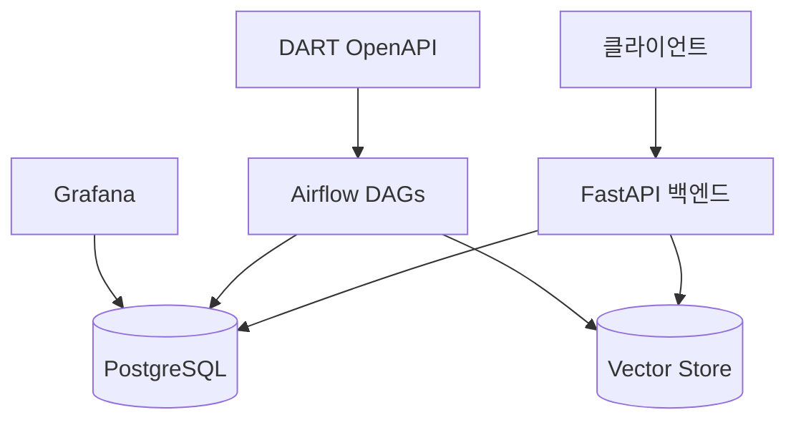

# 🤖 JoopJoop Bot

<div align="center">

[](https://www.python.org/)
[](https://fastapi.tiangolo.com/)
[](https://airflow.apache.org/)
[](https://www.postgresql.org/)
[](https://opensource.org/licenses/MIT)

</div>

> 🚀 DART 공시 정보를 수집하고 AI로 분석하는 지능형 금융 어시스턴트

## ✨ 주요 기능

- 🔄 **실시간 공시 수집**: DART OpenAPI를 통한 기업 공시 정보 자동 수집
- 🤖 **AI 기반 분석**: RAG(Retrieval Augmented Generation) 기술로 공시 내용 분석
- 📊 **데이터 시각화**: Grafana 기반의 직관적인 모니터링 대시보드
- 🔔 **실시간 알림**: 중요 공시 발생 시 즉각적인 알림 제공
- 📝 **자동 요약**: GPT 기반의 공시 내용 자동 요약 기능

## 🏗️ 시스템 아키텍처



## 📁 프로젝트 구조

```
.
├── 📦 packages/            # 공통 패키지
│   └── joopjoop-core/     # 코어 라이브러리 (DART, RAG)
├── 🚀 services/           # 마이크로서비스
│   ├── backend/          # FastAPI 백엔드
│   └── airflow/          # Airflow DAGs
├── 📚 docs/              # 프로젝트 문서
└── 📝 pr/               # PR 템플릿 및 가이드
```

## 🚀 시작하기

### 사전 요구사항

- 🐳 Docker Desktop
- 🐍 Python 3.11+
- 📦 Poetry (Python 패키지 관리자)

### 환경 설정

1. 저장소 클론
```bash
git clone https://github.com/your-username/JoopJoopBot.git
cd JoopJoopBot
```

2. 환경 변수 설정
```bash
cp .env.example .env
# .env 파일을 열어 필요한 값들을 설정
```

3. 개발 환경 실행
```bash
# Docker 서비스 실행
docker-compose up -d

# Core 패키지 설치
cd packages/joopjoop-core
poetry install
```

자세한 설정 방법은 [SETUP-GUIDE.md](docs/setup/SETUP-GUIDE.md)를 참조하세요.

## 🌐 서비스 접속 정보

| 서비스 | URL | 설명 |
|--------|-----|------|
| API | http://localhost:8000 | 백엔드 API 서버 |
| API Docs | http://localhost:8000/docs | Swagger API 문서 |
| Airflow | http://localhost:8080 | 워크플로우 관리 |
| Grafana | http://localhost:3000 | 모니터링 대시보드 |

## 📚 문서

- [설치 가이드](docs/setup/SETUP-GUIDE.md)
- [DART 파이프라인](docs/data-collection/DART-PIPELINE.md)
- [아키텍처 문서](docs/architecture/)
- [API 문서](http://localhost:8000/docs)

## 🧪 테스트

```bash
# Core 패키지 테스트
cd packages/joopjoop-core
poetry run pytest

# Airflow DAG 테스트
cd services/airflow
poetry run pytest
```

## 📝 라이선스

이 프로젝트는 MIT 라이선스를 따릅니다. 자세한 내용은 [LICENSE](LICENSE) 파일을 참조하세요.

## 🤝 기여하기

1. 이 저장소를 포크합니다
2. 새로운 브랜치를 생성합니다 (`git checkout -b feature/amazing-feature`)
3. 변경사항을 커밋합니다 (`git commit -m 'feat: add amazing feature'`)
4. 브랜치에 푸시합니다 (`git push origin feature/amazing-feature`)
5. Pull Request를 생성합니다 