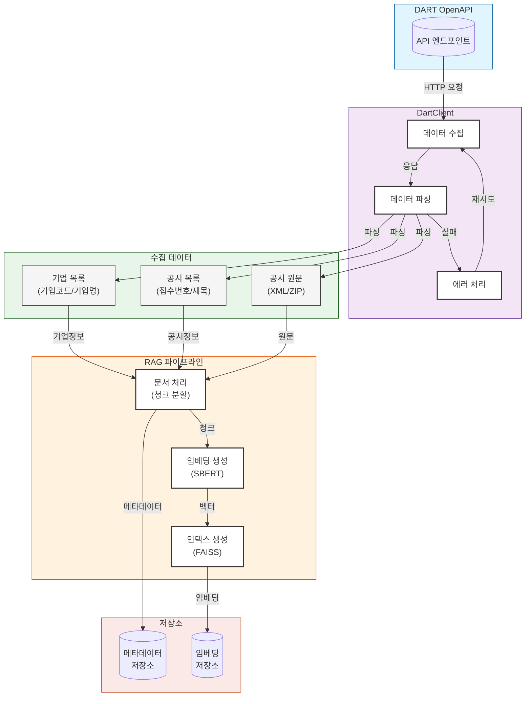

# DART 데이터 수집 및 저장

## 개요

JoopJoop은 DART(Data Analysis, Retrieval and Transfer) 시스템에서 기업 공시 데이터를 수집하고 저장하는 파이프라인을 제공합니다. 이 문서는 데이터 수집 프로세스의 전반적인 흐름과 구현 세부사항을 설명합니다.

## 데이터 흐름



## 주요 컴포넌트

### 1. DartClient (`joopjoop.dart.client`)

- **역할**: DART OpenAPI와의 통신을 담당
- **주요 기능**:
  - 기업 고유번호 목록 조회
  - 기업 기본정보 조회
  - 공시 목록 조회
  - 공시 원문 조회 및 파싱
- **에러 처리**: 
  - API 호출 실패 시 자동 재시도
  - XML 파싱 오류 처리
  - ZIP 파일 처리

### 2. RAG 파이프라인 (`joopjoop.rag.pipeline`)

- **역할**: 공시 문서의 처리 및 저장
- **주요 기능**:
  - 문서 청크 분할
  - 임베딩 생성
  - 유사도 검색
- **성능 최적화**:
  - 청크 크기 최적화 (100-512 토큰)
  - FAISS 인덱스 사용
  - 배치 처리 지원

## 데이터 수집 주기

### 1. 기업 정보 수집

- **주기**: 매일 1회 (자정)
- **대상**: 전체 기업 목록
- **업데이트 조건**: 
  - 신규 기업 추가
  - 기존 기업 정보 변경
  - `modify_date` 필드 기준

### 2. 공시 정보 수집

- **주기**: 
  - 실시간 수집 (영업일 09:00-16:00)
  - 일괄 수집 (매일 18:00)
- **대상**:
  - 당일 신규 공시
  - 정정된 공시
- **우선순위**:
  1. 실적 관련 공시
  2. 주요 경영사항
  3. 정기 보고서

## 데이터 저장

### 1. 메타데이터 저장

- **형식**: JSON
- **필수 필드**:
  ```json
  {
    "corp_code": "기업고유번호",
    "corp_name": "기업명",
    "stock_code": "종목코드",
    "receipt_no": "접수번호",
    "disclosure_date": "공시일자",
    "title": "공시제목",
    "dcm_no": "문서번호"
  }
  ```

### 2. 임베딩 저장

- **모델**: `jhgan/ko-sroberta-multitask`
- **차원**: 768
- **인덱스**: FAISS (Flat IP)
- **정규화**: L2 정규화 적용

## 모니터링 및 알림

### 1. 수집 상태 모니터링

- API 응답 상태
- 처리 속도
- 오류 발생 빈도
- 저장소 사용량

### 2. 알림 설정

- API 할당량 초과 시
- 처리 실패 시
- 중요 공시 발생 시

## 실행 방법

1. 환경 설정
```bash
# .env 파일 설정
DART_API_KEY=your_api_key
```

2. 데이터 수집 실행
```bash
# 전체 수집
python -m joopjoop.collector.full

# 증분 수집
python -m joopjoop.collector.incremental
```

## 주의사항

1. **API 사용량 제한**
   - 일일 API 호출 제한: 10,000회
   - 분당 호출 제한: 100회

2. **데이터 정합성**
   - 정정 공시 발생 시 기존 데이터 업데이트
   - 누락된 데이터 주기적 확인

3. **저장소 관리**
   - 정기적인 백업
   - 오래된 데이터 아카이빙
   - 인덱스 최적화 