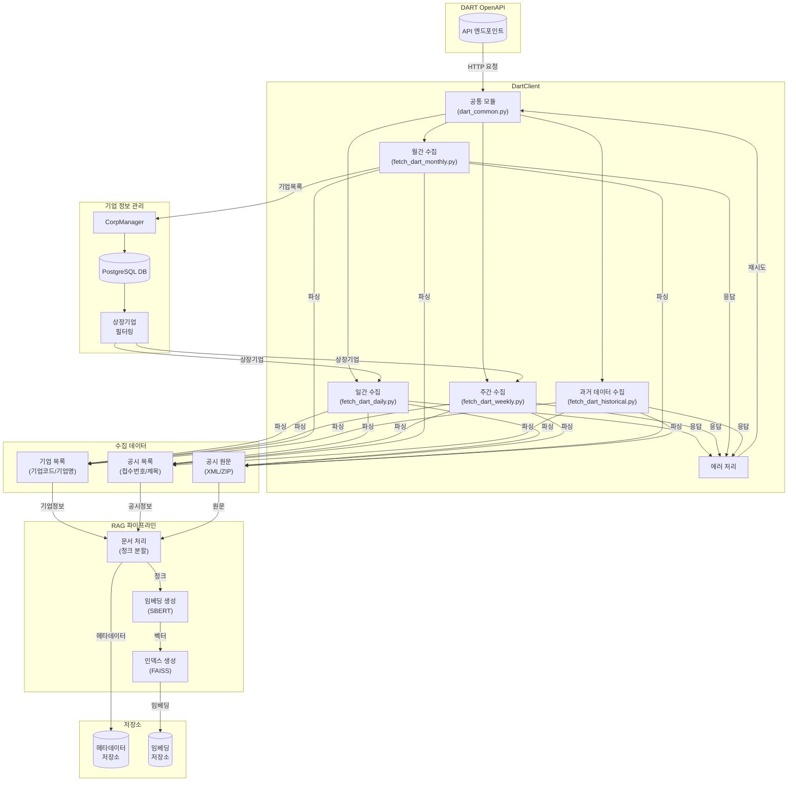

# DART 데이터 수집 기술 아키텍처

## 개요

JoopJoop은 DART(Data Analysis, Retrieval and Transfer) 시스템에서 기업 공시 데이터를 수집하고 저장하는 파이프라인을 제공합니다. 이 문서는 데이터 수집 시스템의 기술적 아키텍처와 구현 세부사항을 설명합니다.

## 시스템 아키텍처



## 주요 컴포넌트

### 1. DartClient (`joopjoop.dart.client`)

- **역할**: DART OpenAPI와의 통신을 담당
- **주요 기능**:
  - 기업 고유번호 목록 조회
  - 기업 기본정보 조회
  - 공시 목록 조회
  - 공시 원문 조회 및 파싱
- **에러 처리**: 
  - API 호출 실패 시 자동 재시도
  - XML 파싱 오류 처리
  - ZIP 파일 처리

### 2. CorpManager (`joopjoop.dart.corp_manager`)

- **역할**: 기업 정보 관리 및 상장기업 필터링
- **주요 기능**:
  - PostgreSQL DB 기반 기업 정보 관리
  - 상장/비상장 기업 구분
  - 기업 정보 CRUD 작업
  - 마지막 수집 시간 추적
- **성능 최적화**:
  - 인덱스 활용
  - 배치 업데이트 지원
  - 트랜잭션 관리

### 3. DartCollector (`joopjoop.dart.collector`)

- **역할**: 공시 문서의 수집 및 저장
- **주요 기능**:
  - 문서 메타데이터 추출
  - PostgreSQL DB 저장
  - 벡터 DB 저장 (옵션)
- **성능 최적화**:
  - 트랜잭션 관리
  - 벌크 삽입 지원
  - 에러 복구

### 4. RAG 파이프라인 (`joopjoop.rag.pipeline`)

- **역할**: 공시 문서의 처리 및 벡터화
- **주요 기능**:
  - 문서 청크 분할
  - 임베딩 생성
  - 유사도 검색
- **성능 최적화**:
  - 청크 크기 최적화 (100-512 토큰)
  - FAISS 인덱스 사용
  - 배치 처리 지원

## 데이터 모델

### 1. 기업 정보 스키마

```sql
CREATE TABLE corps (
    corp_code VARCHAR(8) PRIMARY KEY,  -- 기업고유번호
    corp_name VARCHAR(100) NOT NULL,   -- 기업명
    stock_code VARCHAR(6),             -- 종목코드
    is_listed BOOLEAN,                 -- 상장여부
    modified_at TIMESTAMP WITH TIME ZONE, -- 수정 시간
    last_update TIMESTAMP WITH TIME ZONE  -- 마지막 수집 시간
);

CREATE INDEX idx_corps_stock_code ON corps(stock_code);
CREATE INDEX idx_corps_is_listed ON corps(is_listed);
CREATE INDEX idx_corps_last_update ON corps(last_update);
```

### 2. 공시 정보 스키마

```sql
CREATE TABLE dart_reports (
    id SERIAL PRIMARY KEY,
    corp_code VARCHAR(8) NOT NULL,
    corp_name VARCHAR(100) NOT NULL,
    receipt_no VARCHAR(14) NOT NULL UNIQUE,
    report_type VARCHAR(100) NOT NULL,
    title VARCHAR(300) NOT NULL,
    content TEXT NOT NULL,
    disclosure_date DATE NOT NULL,
    meta_data JSONB
);

CREATE INDEX idx_dart_reports_corp_code ON dart_reports(corp_code);
CREATE INDEX idx_dart_reports_receipt_no ON dart_reports(receipt_no);
CREATE INDEX idx_dart_reports_disclosure_date ON dart_reports(disclosure_date);
```

### 3. 메타데이터 스키마

```json
{
  "dcm_no": "문서번호",
  "url": "공시 원문 URL",
  "file_name": "파일명",
  "page_count": "페이지 수",
  "report_type": {
    "code": "보고서 타입 코드",
    "category": "대분류",
    "subcategory": "중분류",
    "detail": "세부 분류",
    "collection_cycle": "수집주기(daily/weekly/monthly)"
  }
}
```

### 4. 임베딩 설정

- **모델**: `jhgan/ko-sroberta-multitask`
- **차원**: 768
- **인덱스**: FAISS (Flat IP)
- **정규화**: L2 정규화 적용

## 구현 세부사항

### 1. 기업 정보 관리

```python
# corp_manager.py
class CorpManager:
    def __init__(self, db_config: Dict[str, Any]):
        """기업 정보 관리자 초기화"""
        self.db_config = db_config
        self._init_db()

    def _init_db(self):
        """DB 초기화"""
        pass

    def upsert_corps(self, corps: List[Dict]) -> None:
        """기업 정보 일괄 업데이트"""
        pass

    def get_all_corps(self, only_listed: bool = False) -> List[Dict]:
        """기업 목록 조회"""
        pass

    def update_collection_timestamp(self, corp_code: str) -> None:
        """수집 시간 업데이트"""
        pass
```

### 2. 문서 수집 및 처리

```python
# collector.py
class DartCollector:
    def __init__(
        self,
        db_config: Dict[str, Any],
        rag_pipeline: Optional[RAGPipeline] = None,
        vector_store_enabled: bool = True
    ):
        self.db_config = db_config
        self.rag_pipeline = rag_pipeline
        self.vector_store_enabled = vector_store_enabled

    def process_document(self, document: Dict[str, Any]) -> bool:
        """문서 처리 및 저장"""
        pass
```

## 저장소 관리

### 1. PostgreSQL DB 관리
- 주기적 백업 (pg_dump)
- 인덱스 최적화 (VACUUM ANALYZE)
- 파티셔닝 적용 (disclosure_date 기준)
- 모니터링 설정

### 2. 벡터 DB 관리
- 일일 증분 백업
- 주간 전체 백업
- 30일 보관 정책
- 인덱스 최적화
- 임베딩 압축 적용
- 캐시 활용

### 3. 데이터 정리
- 오래된 데이터 아카이빙
- 중복 데이터 제거
- 저장소 공간 최적화

## 개발 환경 설정

1. Docker 환경 구성
```bash
docker-compose up -d
```

2. 환경 변수 설정
```bash
# .env
DART_API_KEY=your_api_key
VECTOR_DB_PATH=/path/to/vector/store

# PostgreSQL 설정
POSTGRES_HOST=localhost
POSTGRES_PORT=15432
POSTGRES_USER=postgres
POSTGRES_PASSWORD=postgres
POSTGRES_DB=backend

# 테스트용 DB 설정
TEST_POSTGRES_USER=test
TEST_POSTGRES_PASSWORD=1234
TEST_API_POSTGRES_DB=api_test
TEST_AIRFLOW_POSTGRES_DB=airflow_test
```

3. 의존성 설치
```bash
cd packages/joopjoop-core
poetry install
```
