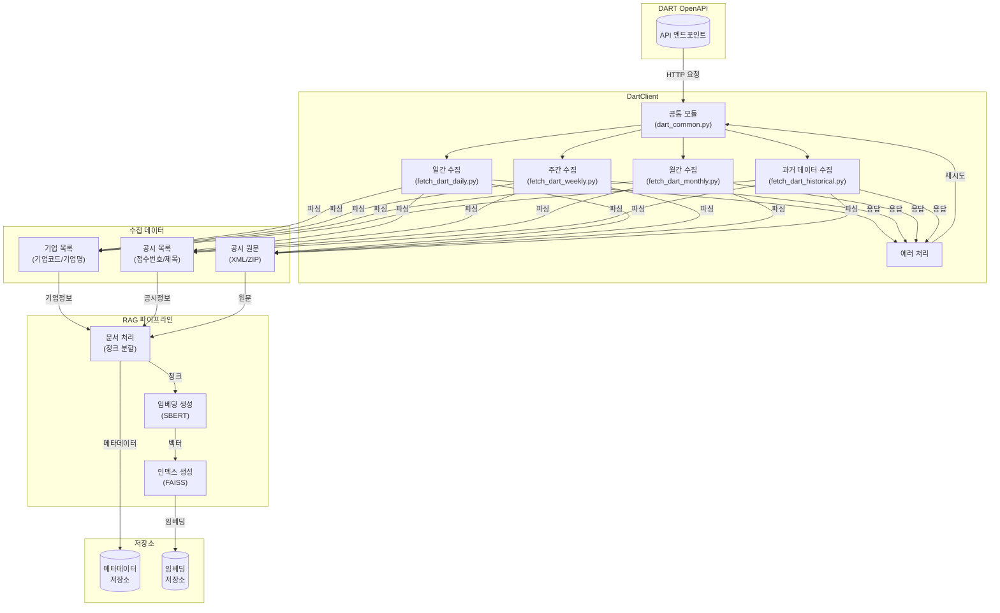

# DART 데이터 수집 기술 아키텍처

## 개요

JoopJoop은 DART(Data Analysis, Retrieval and Transfer) 시스템에서 기업 공시 데이터를 수집하고 저장하는 파이프라인을 제공합니다. 이 문서는 데이터 수집 시스템의 기술적 아키텍처와 구현 세부사항을 설명합니다.

## 시스템 아키텍처



## 주요 컴포넌트

### 1. DartClient (`joopjoop.dart.client`)

- **역할**: DART OpenAPI와의 통신을 담당
- **주요 기능**:
  - 기업 고유번호 목록 조회
  - 기업 기본정보 조회
  - 공시 목록 조회
  - 공시 원문 조회 및 파싱
- **에러 처리**: 
  - API 호출 실패 시 자동 재시도
  - XML 파싱 오류 처리
  - ZIP 파일 처리

### 2. RAG 파이프라인 (`joopjoop.rag.pipeline`)

- **역할**: 공시 문서의 처리 및 저장
- **주요 기능**:
  - 문서 청크 분할
  - 임베딩 생성
  - 유사도 검색
- **성능 최적화**:
  - 청크 크기 최적화 (100-512 토큰)
  - FAISS 인덱스 사용
  - 배치 처리 지원

## 데이터 모델

### 1. 메타데이터 스키마

```json
{
  "corp_code": "기업고유번호",
  "corp_name": "기업명",
  "stock_code": "종목코드",
  "receipt_no": "접수번호",
  "disclosure_date": "공시일자",
  "title": "공시제목",
  "dcm_no": "문서번호",
  "report_type": {
    "code": "보고서 타입 코드",
    "category": "대분류",
    "subcategory": "중분류",
    "detail": "세부 분류",
    "collection_cycle": "수집주기(daily/weekly/monthly)"
  },
  "dates": {
    "submit": "제출일자",
    "base": "기준일자",
    "modify": "수정일자"
  }
}
```

### 2. 임베딩 설정

- **모델**: `jhgan/ko-sroberta-multitask`
- **차원**: 768
- **인덱스**: FAISS (Flat IP)
- **정규화**: L2 정규화 적용

## 구현 세부사항

### 1. 데이터 수집 프로세스

```python
# dart_common.py - 공통 모듈
class DartCommon:
    def fetch_corps(self):
        """기업 목록 수집"""
        pass

    def fetch_disclosures(self, corp_code: str, start_date: str, end_date: str):
        """공시 목록 수집"""
        pass

    def collect_document(self, rcept_no: str):
        """공시 원문 수집"""
        pass

    def get_report_group(self, report_code: str) -> str:
        """보고서 코드의 수집 주기 반환"""
        pass

# 각 DAG별 구현
class DartDailyCollector(DartCommon):
    """일간 수집 DAG 구현"""
    pass

class DartWeeklyCollector(DartCommon):
    """주간 수집 DAG 구현"""
    pass

class DartMonthlyCollector(DartCommon):
    """월간 수집 DAG 구현"""
    pass

class DartHistoricalCollector(DartCommon):
    """과거 데이터 수집 DAG 구현"""
    pass
```

### 2. 문서 처리 파이프라인

```python
class DocumentProcessor:
    def process(self, document: str):
        """문서 처리 메인 로직"""
        chunks = self.split_into_chunks(document)
        embeddings = self.create_embeddings(chunks)
        self.store_embeddings(embeddings)

    def split_into_chunks(self, document: str) -> List[str]:
        """문서 청크 분할"""
        pass

    def create_embeddings(self, chunks: List[str]) -> np.ndarray:
        """임베딩 생성"""
        pass

    def store_embeddings(self, embeddings: np.ndarray):
        """임베딩 저장"""
        pass
```

## 저장소 관리

### 1. 백업 전략
- 일일 증분 백업
- 주간 전체 백업
- 30일 보관 정책

### 2. 인덱스 최적화
- 주기적 인덱스 재구축
- 임베딩 압축 적용
- 캐시 활용

### 3. 데이터 정리
- 오래된 데이터 아카이빙
- 중복 데이터 제거
- 저장소 공간 최적화

## 개발 환경 설정

1. 의존성 설치
```bash
poetry install
```

2. 환경 변수 설정
```bash
# .env
DART_API_KEY=your_api_key
VECTOR_DB_PATH=/path/to/vector/store
AIRFLOW_ALERT_EMAIL=alerts@example.com  # 알림 설정용
```

3. 테스트 실행
```bash
# 공통 모듈 테스트
poetry run pytest tests/dags/test_dart_common.py

# 각 DAG 테스트
poetry run pytest tests/dags/test_dart_daily.py
poetry run pytest tests/dags/test_dart_weekly.py
poetry run pytest tests/dags/test_dart_monthly.py
poetry run pytest tests/dags/test_dart_historical.py
``` 